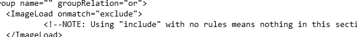
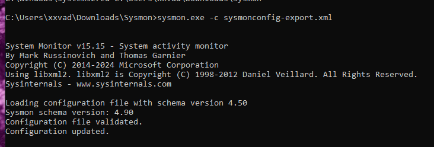
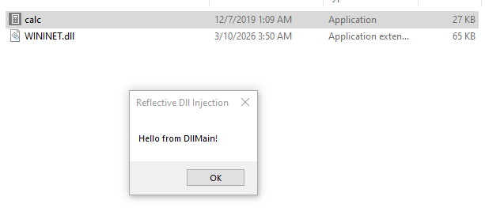
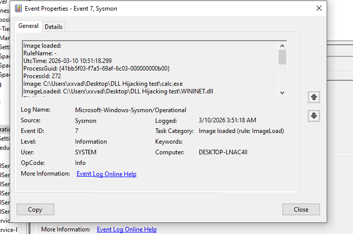

# Detecting DLL Hijacking with Sysmon

## Objective
This folder contains a hands-on walk-through of simulating and detecting a DLL Hijacking attack on a Windows machine. The goal is to successfully hijack `calc.exe` to execute a custom payload, and then use Sysmon to hunt down the Indicators of Compromise (IOCs) by comparing normal system behavior against the hijacked execution.

## Tools & Prerequisites
* **OS:** Windows VM
* **Monitoring:** Sysmon (System Monitor) + SwiftOnSecurity configuration
* **Vulnerable Binary:** Windows Calculator (`calc.exe`)
* **Payload:** [Stephen Fewer's Reflective DLL Injection](https://github.com/stephenfewer/ReflectiveDLLInjection/blob/master/bin/reflective_dll.x64.dll)

---

## Phase 1: Configuring Sysmon for Module Loads
To detect a DLL hijack, we need to monitor for suspicious module load events. By default, Sysmon might not capture everything we need, so the first step is adjusting the configuration.

I modified the `sysmonconfig-export.xml` file, specifically targeting the `ImageLoad` section. By changing the condition to `<ImageLoad onmatch="exclude">`, we ensure that no module loads are filtered out, allowing us to capture the necessary telemetry.

*(Image: Modifying the Sysmon XML config)*

After updating the XML, I applied the new configuration via the command prompt:
`sysmon.exe -c sysmonconfig-export.xml`

*(Image: Successfully updating the Sysmon schema)*

---

## Phase 2: Executing the Hijack
With Sysmon watching, it was time to execute the attack. `calc.exe` is known to be vulnerable to DLL hijacking, specifically looking for `WININET.dll` in its current directory before checking system folders.

1. Downloaded the compiled `reflective_dll.x64.dll` payload.
2. Renamed the payload to `WININET.dll`.
3. Copied the legitimate `calc.exe` from `C:\Windows\System32` into a custom directory (`C:\Users\xxvad\Desktop\DLL Hijacking test\`).
4. Placed the fake `WININET.dll` right next to it.

Upon launching the copied `calc.exe`, the application grabbed our malicious DLL instead of the legitimate Windows one, executing the payload and popping a `MessageBox`.

*(Image: Successful hijack showing the Reflective Dll Injection popup)*

---

## Phase 3: Hunting for IOCs in Event Viewer
To detect this activity, we need to look at **Sysmon Event ID 7 (Image Loaded)**. By comparing a normal execution of `calc.exe` against our hijacked execution, the anomalies become obvious.

### The Baseline (Normal Execution)
I ran a normal instance of Calculator and pulled the Event ID 7 log. As expected, everything runs out of the heavily protected `System32` directory.

*(Image: Normal calc.exe execution)*
* **Image:** `C:\Windows\System32\calc.exe`
* **ImageLoaded:** `C:\Windows\System32\wininet.dll`
* **Signature:** Valid Microsoft Windows signature.

### The Malicious Execution (Hijacked)
Next, I checked the logs for the exact timeframe of the attack. 

*(Image: Hijacked calc.exe execution)*

By comparing the two, we can establish three rock-solid **Indicators of Compromise (IOCs)** for this specific hijack:

1. **Abnormal Binary Path:** The legitimate `calc.exe` should only execute from `C:\Windows\System32` or `Syswow64`. In the malicious log, it is executing from a writable user directory (`C:\Users\xxvad\Desktop\DLL Hijacking test\calc.exe`).
2. **Abnormal Module Load Path:** The parent process `calc.exe` should not be loading `WININET.dll` from a desktop folder. 
3. **Unsigned DLL:** Checking the signature fields for the hijacked log will show that the payload DLL is unsigned, whereas the legitimate `WININET.dll` is signed by Microsoft.

## Conclusion
This exercise highlights how effective "Bring Your Own Land" (or simply moving legitimate binaries into unprotected directories) can be for bypassing basic execution restrictions. However, with proper Sysmon tuning and baseline comparisons, detecting the abnormal module loads makes identifying the hijack straightforward.